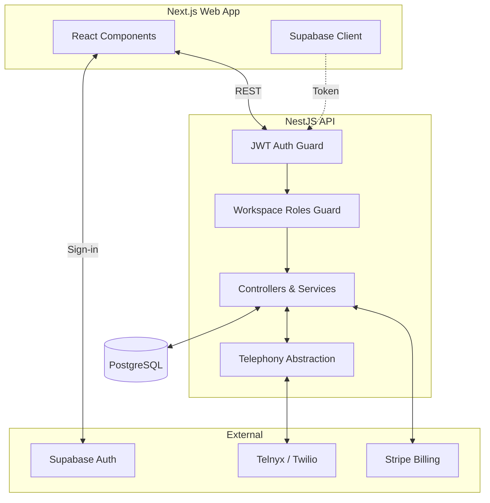

# System Architecture

CallFlow uses a decoupled frontend-backend model built on Next.js and NestJS, backed by a PostgreSQL database managed by Prisma. 
Tenant isolation is enforced via Supabase authentication and strict Role-Based Access Control on the backend.
Telephony is abstracted behind a generic `TelephonyProvider` interface to separate domain logic from provider-specific details.

